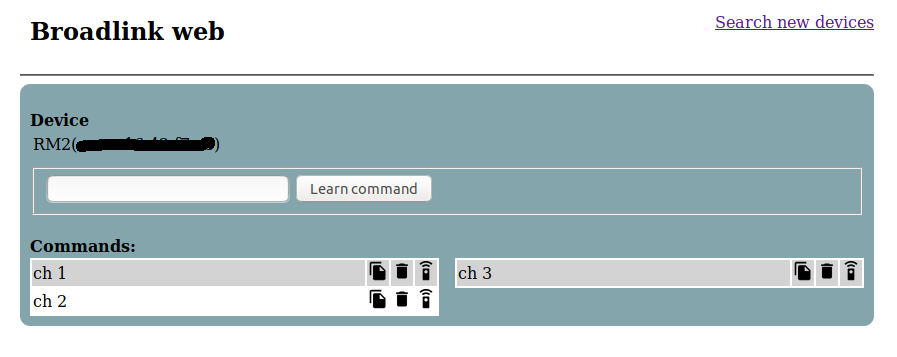

# Broadlink web

## About
Broadlink web allows you to learn and send ir commands using broadlink devices. It's also possible to copy the learned commands so they can be used in home assistant. Broadlink web automatically discovers any supported broadlink devices in the network.


## Installation
### Prerequisites:
* You have a supported broadlink device connected to your wifi see https://www.ibroadlink.com/support/ for more information about how to connect the device to your network
* You have docker installed (only if you want to run Broadlink web using docker) see: https://docs.docker.com/install/
* You have python 3 installed on your system (only if you want to run Broadlink web directly from your system)

### Installation:
Broadlink web can be installed in two different ways. Using docker or running locally using python.

Clone or download the repository and execute the folling commands depending on what method you prefere.

Docker:
```
docker run -d -p 8000:8000 -v devices:/src/broadlinkweb/devices/ --name broadlink -it frenger/broadlinkweb
```

Python:
```
pip install -r requirements.txt
python run.py
```

Now open your browser and visit http://localhost:8000 and you should be ready to go.

## Known issues
Broadlink web is for now only tested with the Broadlink mini 3, but should also work with other Broadlink ir devices. If you run into problems with your devices or you tested another Broadlink device please let me know.